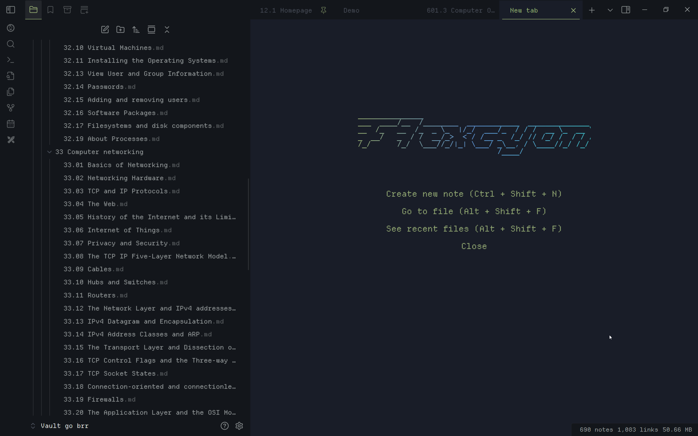
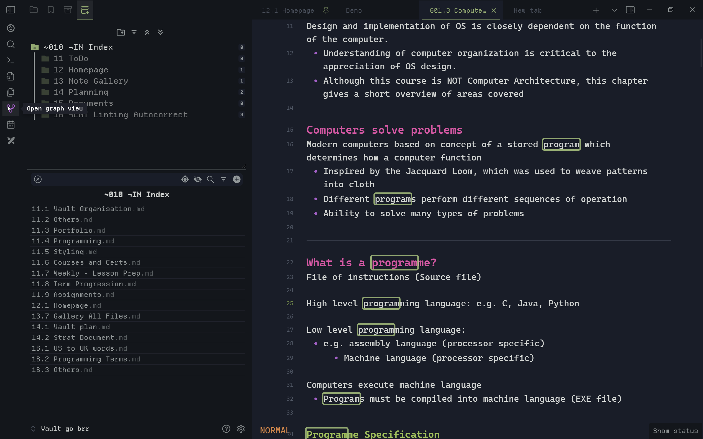
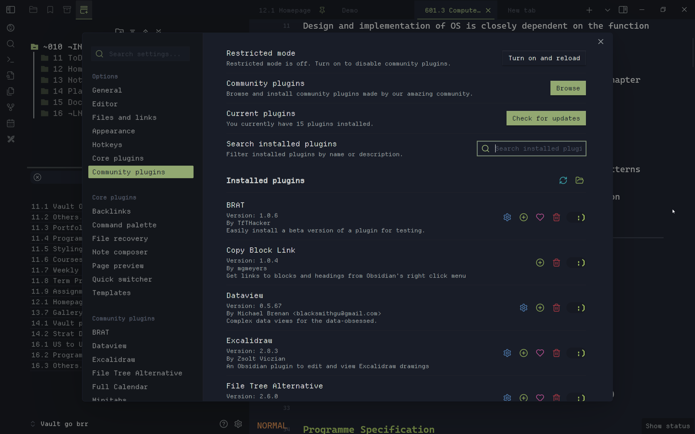

<figure markdown="span">
    
    <figcaption>Figure 1: ASCII Art, Dimmed File Extensions</figcaption>
</figure>

<figure markdown="span">
    
    <figcaption>Figure 2: Vim Mode Status, Colored Headings, Hide Until Hover Status Bar</figcaption>
</figure>

<figure markdown="span">
    
    <figcaption>Figure 3: Dimmed inactive Settings navigation, smiley and coloured icons</figcaption>
</figure>