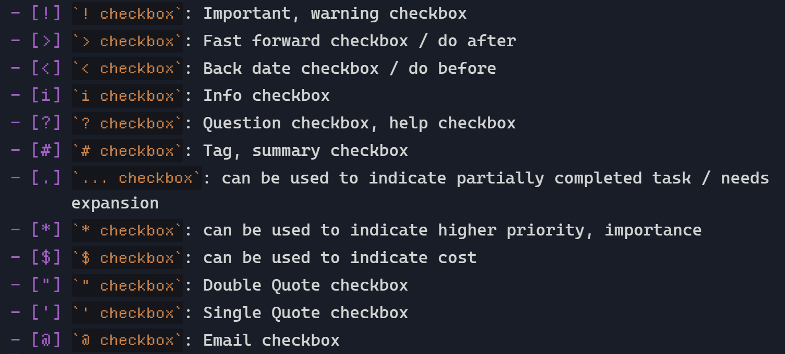

在此子页面中, 您可以找到复选框样式的使用示例。

## 截图

<figure markdown="span">
    
    <figcaption>图1:ASCII复选框</figcaption>
</figure>

<figure markdown="span">
    
    <figcaption>图2：Source Mode 下的ASCII复选框</figcaption>
</figure>

## 导航

```md
Style Settings
|-- ...
|-- Flexcyon Style Settings
| |-- Editor
| | |-- ...
| | |-- Checkboxes
| | |-- ...
| |-- ...
|-- ...
```

## 配置选项

接受的格式: rem

### 启用 ASCII 复选框

目标 CSS 变量: `var(--flexcyon-ascii-checkboxes-enabled)`

默认: true (类切换)

### ASCII 复选框字体大小

目标 CSS 变量: `var(--flexcyon-ascii-checkboxes-font-size)`

默认: 1.2 (rem)

<span style="font-size: 1.2rem">Sample ASCII checkboxes font size</span>

### 启用剪辑路径复选框

目标 CSS 变量: `var(--flexcyon-clip-path-checkboxes-enabled)`

默认: false (类切换)
