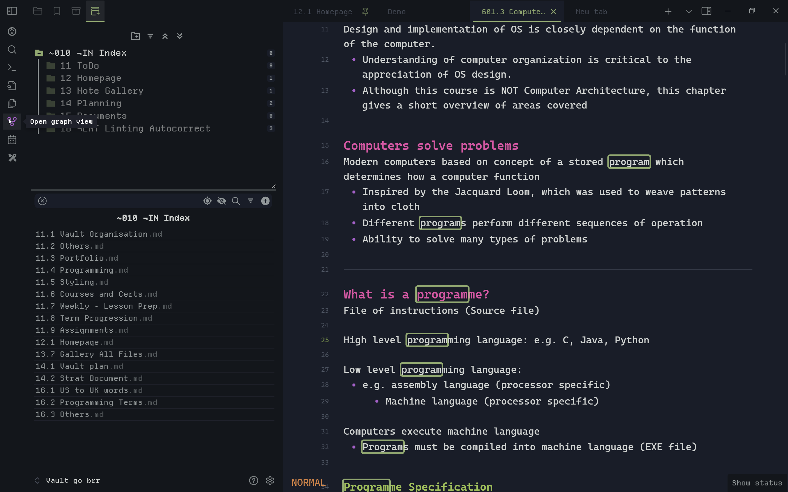

<figure markdown="span">
    
    <figcaption
>图1:ASCII艺术,凹陷文件扩展</figcaption>
</figure>

<figure markdown="span">
    
    <figcaption
>图2:Vim模式状态,彩色标题,隐藏直到 Hover状态栏</figcaption>
</figure>

<figure markdown="span">
    
    <figcaption
>图3 暗淡的非活动设置 导航、微笑和彩色图标</figcaption>
</figure>