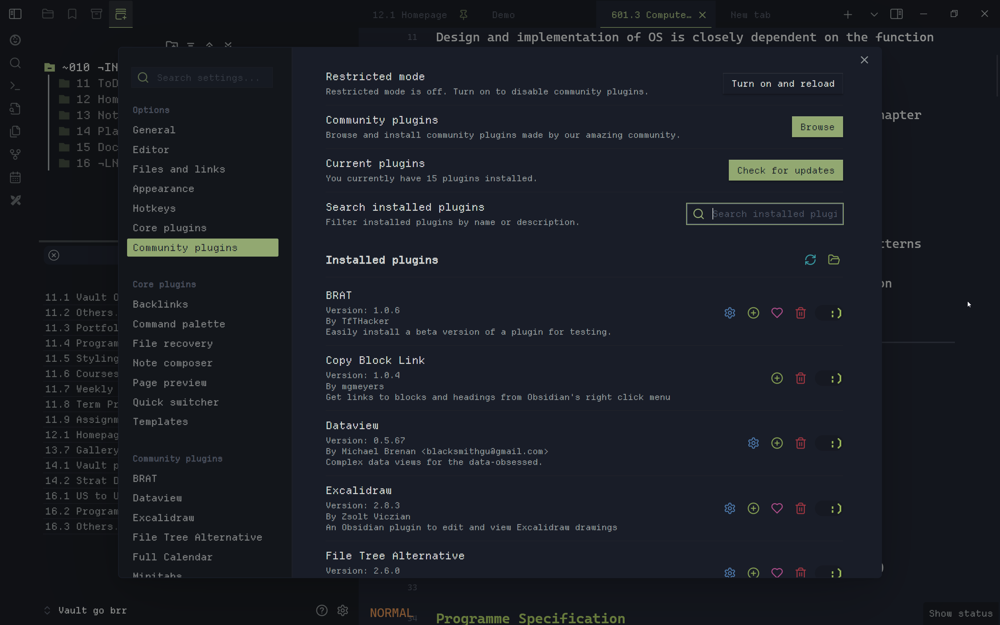
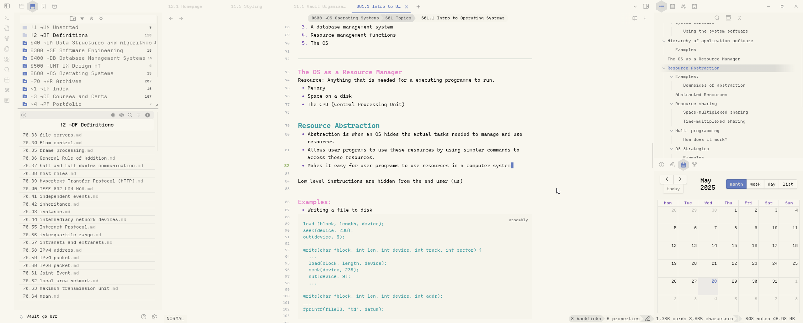

<figure markdown="span">
    
    <figcaption
>Figure 1: ASCII Art, Dimmed File Extensions</figcaption>
</figure>

<figure markdown="span">
    
    <figcaption
>Figure 2: Vim Mode Status, Coloured Headings, Hide Until Hover
    Status Bar</figcaption>
</figure>

<figure markdown="span">
    
    <figcaption
>图3 暗淡的非活动设置导航、微笑和
彩色图标</figcaption>
</figure>

<figure markdown="span">
    
    <figcaption
>Figure 4: Light Mode with Powerlevel10k layout and status style</figcaption>
</figure>
